# CollabCanvas Architecture (Mermaid Diagrams)

## 1️⃣ System Architecture
```mermaid
flowchart TD
  subgraph Client["Browser UI (Phase 3)"]
    subgraph TopLevel["Top Interface"]
      RIBBON[File Ribbon<br/>New, Open, Save, Export]
      TABS[Canvas Tabs<br/>+ Add Tab, × Close Tab<br/>Editable Titles]
    end
    
    subgraph UI["React Components"]
      CANVAS[Konva Canvas<br/>Pan/Zoom/Select<br/>Per-Tab State]
      TOOLBAR[Categorized Toolbar<br/>📏 Lines & Arrows<br/>🔷 Shapes (▭●▲★♥)<br/>😊 Emojis (12 clickable)<br/>⭐ Symbols<br/>📝 Forms<br/>🎯 Assets (📝)]
      CONTEXT[Right-Click Context Menu<br/>Fill, Outline, Text Formatting]
      HELP[Help Panel<br/>AI Commands<br/>Shortcuts<br/>Tips]
    end
    
    S[Zustand Store<br/>Multi-Canvas State<br/>Active Tab Management<br/>Shapes, Selection, History]
    ENV[.env Variables<br/>Supabase + AI Keys]
  end

  subgraph Supabase["Supabase Platform"]
    R[Realtime Channels<br/>room:&lt;canvas_id&gt;<br/>• broadcasts (shape:upsert/remove)<br/>• presence (cursors, online users)]
    DB[(Postgres<br/>public.canvases (projects)<br/>public.shapes (per canvas)<br/>public.user_profiles)]
    AUTH[Auth (Anonymous + Profiles)]
  end
  
  subgraph Export["Export System"]
    PDF[PDF Export<br/>High-quality rendering<br/>Vector graphics]
    PNG[PNG Export<br/>Raster graphics<br/>Custom dimensions]
    PRINT[Print Options<br/>Page layouts<br/>Scale options]
  end

  subgraph AI["Multi-Tier AI System"]
    SERVERLESS[Vercel API (/api/ai)<br/>Groq + OpenAI]
    BROWSER[Browser Fallback<br/>Direct API Calls]
    RULES[Rule-Based Fallback<br/>Pattern Matching]
  end

  TopLevel <--> UI
  UI <--> S
  S -->|load keys| ENV
  CANVAS -->|subscribe / track presence| R
  CANVAS -->|broadcast deltas<br/>(shape:upsert/remove)| R
  R -->|fan-out updates| CANVAS
  CANVAS -->|persist canvas & shapes| DB
  CANVAS -->|load canvas on tab switch| DB
  
  RIBBON -->|export commands| Export
  Export -->|canvas data| CANVAS

  UI -->|sign in anon (JWT)| AUTH
  AUTH -->|session + profile| UI

  HELP -->|AI prompt| SERVERLESS
  SERVERLESS -->|response| HELP
  SERVERLESS -.->|fallback| BROWSER
  BROWSER -.->|fallback| RULES
  SERVERLESS -->|shape actions| R
  R -->|broadcast AI actions| CANVAS

## 2️⃣ Multi-Canvas System (Phase 3)

```mermaid
flowchart TD
    subgraph TabSystem["Canvas Tab Management"]
        TABS[Tab Bar Component]
        ADD[+ Add New Tab]
        CLOSE[× Close Tab] 
        TITLE[Editable Tab Titles]
    end
    
    subgraph FileSystem["File Operations"]
        RIBBON[File Ribbon Menu]
        NEW[New Canvas]
        OPEN[Open Canvas] 
        SAVE[Save Canvas]
        EXPORT[Export PDF/PNG]
    end
    
    subgraph Database["Canvas Database Schema"]
        CANVASES[(canvases table<br/>id, title, user_id, room_id<br/>created_at, updated_at, data)]
        SHAPES[(shapes table<br/>id, canvas_id, type, x, y<br/>w, h, color, text, etc.)]
        PROFILES[(user_profiles)]
    end
    
    subgraph State["Multi-Canvas State"]
        ACTIVE[Active Canvas ID]
        CANVASLIST[Canvas List/Metadata] 
        UNSAVED[Unsaved Changes Tracking]
        AUTOSAVE[Auto-save System]
    end
    
    TABS --> ACTIVE
    ADD --> NEW
    CLOSE --> SAVE
    NEW --> CANVASES
    OPEN --> CANVASES  
    SAVE --> CANVASES
    CANVASES --> SHAPES
    ACTIVE --> State
    EXPORT --> FileSystem
```

## 3️⃣ UI Component Architecture (Phase 2) - ✅ COMPLETED
```mermaid
flowchart LR
  subgraph Toolbar["Categorized Toolbar"]
    LINES[📏 Lines & Arrows<br/>- Line tool (future phase)<br/>- Arrow variants (future phase)<br/>- Thickness via context menu]
    SHAPES[🔷 Shapes ✅ COMPLETE<br/>- ▭ Rectangle, ● Circle, 📝 Text<br/>- ▲ Triangle, ★ Star, ♥ Heart<br/>- ⬟ Pentagon, ⬢ Hexagon, ⬣ Octagon<br/>- ◊ Rhombus, ⬢ Parallelogram, ◭ Trapezoid, ⬭ Oval<br/>- Visual icons with hover tooltips]
    EMOJIS[😊 Emojis ✅ COMPLETE<br/>- 12 popular emojis (😀😎🎉💡❤️🔥⭐🎯🚀💎🎨⚡)<br/>- Smart placement, centered alignment<br/>- Real-time multiplayer sync]
    SYMBOLS[⭐ Symbols<br/>- Professional icons (future)<br/>- SVG graphics library (future)<br/>- Custom uploads (future)]
    FORMS[📝 Forms<br/>- Login form layouts (AI-generated)<br/>- Contact form layouts (AI-generated)<br/>- Custom form components (future)]
    ASSETS[🎯 Assets<br/>- 📝 Text Box ✅ ACTIVE<br/>- Navigation bars (AI-generated)<br/>- Card layouts (AI-generated)<br/>- Component library (future)]
  end
  
  subgraph ContextMenu["Right-Click Context Menu ✅ COMPLETE"]
    TRIGGER[Object Right-Click ✅<br/>- Shape selection detection<br/>- Smart menu positioning<br/>- Click-outside closing]
    SHAPESTYLE[Shape Styling ✅<br/>- Fill color picker (full spectrum)<br/>- Outline color & weight (0-10px)<br/>- Delete action with undo support]
    TEXTSTYLE[Text Formatting ✅<br/>- Font size: dual input (1-256px)<br/>- Font family: dropdown selection<br/>- Text color picker<br/>- Text outline color & weight]
    ACTIONS[Object Actions ✅<br/>- Delete with confirmation<br/>- Undo integration (Ctrl+Z)<br/>- History preservation]
  end
  
  subgraph ColorSystem["Universal Color System ✅ COMPLETE"]
    PALETTE[Color Palette ✅<br/>- Full spectrum picker<br/>- Hex input support<br/>- Real-time preview<br/>- Consistent across all menus]
    CONSISTENCY[Professional UX ✅<br/>- Same picker everywhere<br/>- Smooth interactions<br/>- Mobile-friendly design]
  end
  
  subgraph HelpSystem["Help & AI System ✅ COMPLETE"]
    HELP_ICON[❓ Help Icon ✅<br/>- Collapsible panel<br/>- Positioned near sign out]
    AI_COMMANDS[AI Commands ✅<br/>- Example prompts<br/>- Multi-language tips<br/>- Voice input instructions]
    SHORTCUTS[Keyboard Shortcuts ✅<br/>- Ctrl+Z (Undo)<br/>- Delete key<br/>- Clear canvas with confirmation]
  end
  
  subgraph AIEnhanced["Enhanced AI System ✅ NEW"]
    LANGUAGES[Multi-Language Support ✅<br/>- 7 languages: EN, ZH, ES, FR, DE, JA, AR<br/>- Language-specific speech recognition<br/>- Localized system prompts]
    VOICE[Voice Input ✅<br/>- Speech-to-text integration<br/>- Language code mapping<br/>- Real-time recognition]
    SMART[Smart Behaviors ✅<br/>- Auto-select created shapes<br/>- Blank area detection<br/>- Optimized emoji placement]
  end

  TOOLBAR --> SHAPES
  SHAPES --> ColorSystem
  TOOLBAR --> LINES
  LINES --> ColorSystem
  HelpSystem --> AI_COMMANDS
```

## 4️⃣ Shape System Architecture ✅ COMPLETED
```mermaid
flowchart TD
  subgraph ShapeTypes["Shape Type System ✅ 15+ SHAPES"]
    BASIC[✅ Basic Shapes<br/>rect, circle, text]
    POLYGONS[✅ Polygons<br/>triangle, pentagon, hexagon, octagon]
    ADVANCED[✅ Advanced Shapes<br/>star, heart, trapezoid, rhombus, parallelogram]
    SPECIAL[✅ Special Shapes<br/>oval (elliptical)]
    EMOJIS[✅ Emoji System<br/>12 popular emojis with smart alignment]
    LINES_FUTURE[🔮 Lines & Arrows (Future)<br/>line, arrow-right, arrow-both]
  end
  
  subgraph Styling["Universal Styling Properties ✅ COMPLETE"]
    FILL[✅ Fill Color<br/>Full spectrum picker<br/>Hex input support]
    OUTLINE[✅ Outline Color<br/>Independent color selection<br/>Per-object customization]
    WEIGHT[✅ Outline Weight<br/>0-10px range<br/>Slider + number input]
    TEXT_STYLE[✅ Text Formatting<br/>Font size: 1-256px (dual input)<br/>Font family: dropdown<br/>Text color + outline]
  end
  
  subgraph Storage["Shape Data Structure ✅ ENHANCED"]
    SHAPE_BASE[✅ ShapeBase Interface<br/>id, type, x, y, w, h, rotation<br/>updated_at, updated_by, color]
    STYLE_PROPS[✅ Styling Properties<br/>stroke (outline color)<br/>strokeWidth (outline weight)]
    TEXT_PROPS[✅ Text Properties<br/>text, fontSize, fontFamily<br/>Text-specific styling]
    CANVAS_LINK[✅ Canvas Relationship<br/>canvas_id (foreign key)<br/>Multi-canvas support]
  end
  
  subgraph Performance["Performance Optimizations ✅"]
    SMART_PLACE[✅ Smart Placement<br/>findBlankArea() algorithm<br/>Prevents shape overlap]
    AUTO_SELECT[✅ Auto-Selection<br/>AI-created shapes auto-selected<br/>Immediate user feedback]
    EMOJI_OPT[✅ Emoji Optimization<br/>Centered alignment<br/>Tight selection bounds]
  end

  ShapeTypes --> Storage
  Styling --> STYLE_PROPS
  ShapeTypes --> Performance
  EMOJIS --> EMOJI_OPT
```

## 4️⃣ Multiplayer Sequence (Updated)


## 5️⃣ Enhanced AI Integration Sequence ✅ MULTI-LANGUAGE

```mermaid
  sequenceDiagram
  participant U as User
  participant LANG as Language Selector
  participant VOICE as Voice Input
  participant AI as AI System (3-tier)
  participant CANVAS as Canvas
  participant RT as Supabase Realtime
  participant DB as Postgres

  U->>LANG: Select Chinese (ZH) from dropdown
  U->>VOICE: 🎤 Speak: "创建一个登录表单" (voice input)
  VOICE->>VOICE: Speech recognition (zh-CN)<br/>Convert to text prompt
  VOICE->>AI: POST /api/ai {prompt: "创建一个登录表单", language: "zh", canvasState}
  
  AI->>AI: Multi-language processing<br/>- Chinese system prompt<br/>- Parse intent → login form<br/>- Plan styled shapes with context
  
  AI->>CANVAS: Return shape actions with smart placement
  CANVAS->>CANVAS: Execute with enhancements:<br/>- Auto-select created shapes<br/>- Use findBlankArea() for positioning<br/>- Apply professional styling
  CANVAS->>RT: broadcast shape:upsert (AI shapes)
  RT-->>CANVAS: fan-out to all clients
  CANVAS->>DB: persist shapes to active canvas
  
  Note over U,DB: ✅ Multi-language AI support<br/>✅ Voice input integration<br/>✅ Smart shape placement<br/>✅ Auto-selection for UX
```


## 6️⃣ Data Model Evolution ✅ MULTI-CANVAS ARCHITECTURE


### **🔒 Row Level Security (RLS) Policies**
- **Canvases**: Users can only access their own canvases (`user_id = auth.uid()`)
- **Shapes**: Accessible based on canvas ownership (via canvas_id foreign key)
- **User Profiles**: Users can read all profiles, modify only their own

---

## 7️⃣ Performance & Testing Architecture ✅ PRODUCTION-READY
```mermaid
flowchart TD
  subgraph Performance["Performance Optimizations ✅"]
    DEBOUNCE[✅ Debounced Persistence<br/>Batch database writes during dragging<br/>Maintains 60 FPS under load]
    DYNAMIC[✅ Dynamic Canvas Sizing<br/>Container-based Stage dimensions<br/>Responsive to window changes]
    PANNING[✅ Global Mouse Listeners<br/>Prevents stuck panning at boundaries<br/>Document-level event handling]
    COLLISION[✅ Smart Placement Algorithm<br/>findBlankArea() prevents overlaps<br/>Intelligent object positioning]
  end
  
  subgraph Testing["Demo & Testing System ✅"]
    DEMO[✅ Demo User System<br/>3 pre-configured accounts<br/>Instant multiplayer testing<br/>localStorage persistence]
    ISOLATION[✅ Room Isolation<br/>URL parameter (?room=demo)<br/>Separate testing environments<br/>Judge-friendly demonstrations]
    STRESS[✅ Stress Testing<br/>+500 shapes performance button<br/>Real-time performance validation<br/>Scale testing capabilities]
    CHANNEL[✅ Single Channel Instance<br/>Prevents missed broadcasts<br/>Reliable multiplayer sync]
  end
  
  subgraph Monitoring["Connection & Status ✅"]
    STATUS[✅ Connection Badge<br/>Live online/connecting status<br/>User reassurance system<br/>Network state awareness]
    PRESENCE[✅ Enhanced Presence<br/>Real-time user count<br/>Multiplayer cursor tracking<br/>Online user indicators]
    ERROR[✅ Error Handling<br/>Graceful degradation<br/>User-friendly error messages<br/>Fallback systems]
  end
  
  subgraph UXPolish["UX Polish & Accessibility ✅"]
    VISUAL[✅ Visual Feedback<br/>Loading states<br/>Success confirmations<br/>Progress indicators]
    RESPONSIVE[✅ Responsive Design<br/>Cross-browser compatibility<br/>Mobile-friendly interactions<br/>Adaptive UI components]
    DIALOG[✅ Smart Dialogs<br/>Unsaved changes warnings<br/>Canvas operation confirmations<br/>Destructive action protection]
    EMOJI_UX[✅ Emoji Optimization<br/>Centered selection bounds<br/>Tight visual alignment<br/>Professional appearance]
  end

  Performance --> Testing
  Testing --> Monitoring
  Monitoring --> UXPolish
```

## 8️⃣ File Management & Export System ✅ ENTERPRISE-READY
```mermaid
flowchart LR
  subgraph TopRibbon["File Management Interface ✅"]
    MENU[✅ Professional File Menu<br/>Clean dropdown design<br/>Grouped operations<br/>Keyboard shortcuts]
    NEW[✅ New Canvas<br/>Title prompting<br/>Automatic tab creation<br/>Shape preservation option]
    OPEN[✅ Open Canvas<br/>Canvas browser dialog<br/>Metadata display (dates)<br/>Quick access to recent]
    SAVE[✅ Save Operations<br/>Save / Save As functionality<br/>Title editing<br/>Success feedback]
    DUPLICATE[✅ Duplicate Canvas<br/>Full shape copying<br/>New tab creation<br/>User confirmation]
  end
  
  subgraph TabSystem["Browser-Style Tabs ✅"]
    TABS[✅ Visual Tab Bar<br/>Active tab highlighting<br/>Unsaved indicators (•)<br/>Professional appearance]
    MANAGEMENT[✅ Tab Management<br/>Close buttons (×)<br/>New tab button (+)<br/>Click to switch]
    LIFECYCLE[✅ Tab Lifecycle<br/>Unsaved change warnings<br/>Confirmation dialogs<br/>Safe closing process]
    STATE[✅ Tab State Persistence<br/>Canvas shape loading<br/>Active tab tracking<br/>Multi-canvas support]
  end
  
  subgraph ExportSystem["Export Capabilities ✅"]
    PNG[✅ PNG Export<br/>High-quality raster<br/>Custom dimensions<br/>2x pixel ratio for clarity]
    PDF[✅ PDF Export<br/>Vector-quality output<br/>Print-ready format<br/>Professional presentation]
    QUALITY[✅ Quality Options<br/>Resolution settings<br/>Format selection<br/>Batch export ready]
  end
  
  subgraph Database["Canvas Persistence ✅"]
    META[✅ Canvas Metadata<br/>Title, timestamps<br/>User ownership<br/>Project organization]
    SHAPES_DB[✅ Shape Persistence<br/>Full styling data<br/>Canvas relationships<br/>Version tracking]
    MIGRATION[✅ Database Migration<br/>Legacy shape support<br/>Safe schema updates<br/>Data integrity]
  end

  TopRibbon --> TabSystem
  TabSystem --> ExportSystem
  ExportSystem --> Database
```