# CollabCanvas Architecture (Mermaid Diagrams)

## 1️⃣ System Architecture
```mermaid
flowchart TD
  subgraph Client["Browser UI (Phase 3)"]
    subgraph TopLevel["Top Interface"]
      RIBBON[File Ribbon<br/>New, Open, Save, Export]
      TABS[Canvas Tabs<br/>+ Add Tab, × Close Tab<br/>Editable Titles]
    end
    
    subgraph UI["React Components"]
      CANVAS[Konva Canvas<br/>Pan/Zoom/Select<br/>Per-Tab State]
      TOOLBAR[Categorized Toolbar<br/>📏 Lines & Arrows<br/>🔷 Shapes (▭●▲★♥)<br/>😊 Emojis (12 clickable)<br/>⭐ Symbols<br/>📝 Forms<br/>🎯 Assets (📝)]
      CONTEXT[Right-Click Context Menu<br/>Fill, Outline, Text Formatting]
      HELP[Help Panel<br/>AI Commands<br/>Shortcuts<br/>Tips]
    end
    
    S[Zustand Store<br/>Multi-Canvas State<br/>Active Tab Management<br/>Shapes, Selection, History]
    ENV[.env Variables<br/>Supabase + AI Keys]
  end

  subgraph Supabase["Supabase Platform"]
    R[Realtime Channels<br/>room:&lt;canvas_id&gt;<br/>• broadcasts (shape:upsert/remove)<br/>• presence (cursors, online users)]
    DB[(Postgres<br/>public.canvases (projects)<br/>public.shapes (per canvas)<br/>public.user_profiles)]
    AUTH[Auth (Anonymous + Profiles)]
  end
  
  subgraph Export["Export System"]
    PDF[PDF Export<br/>High-quality rendering<br/>Vector graphics]
    PNG[PNG Export<br/>Raster graphics<br/>Custom dimensions]
    PRINT[Print Options<br/>Page layouts<br/>Scale options]
  end

  subgraph AI["Multi-Tier AI System"]
    SERVERLESS[Vercel API (/api/ai)<br/>Groq + OpenAI]
    BROWSER[Browser Fallback<br/>Direct API Calls]
    RULES[Rule-Based Fallback<br/>Pattern Matching]
  end

  TopLevel <--> UI
  UI <--> S
  S -->|load keys| ENV
  CANVAS -->|subscribe / track presence| R
  CANVAS -->|broadcast deltas<br/>(shape:upsert/remove)| R
  R -->|fan-out updates| CANVAS
  CANVAS -->|persist canvas & shapes| DB
  CANVAS -->|load canvas on tab switch| DB
  
  RIBBON -->|export commands| Export
  Export -->|canvas data| CANVAS

  UI -->|sign in anon (JWT)| AUTH
  AUTH -->|session + profile| UI

  HELP -->|AI prompt| SERVERLESS
  SERVERLESS -->|response| HELP
  SERVERLESS -.->|fallback| BROWSER
  BROWSER -.->|fallback| RULES
  SERVERLESS -->|shape actions| R
  R -->|broadcast AI actions| CANVAS

## 2️⃣ Multi-Canvas System (Phase 3)

```mermaid
flowchart TD
    subgraph TabSystem["Canvas Tab Management"]
        TABS[Tab Bar Component]
        ADD[+ Add New Tab]
        CLOSE[× Close Tab] 
        TITLE[Editable Tab Titles]
    end
    
    subgraph FileSystem["File Operations"]
        RIBBON[File Ribbon Menu]
        NEW[New Canvas]
        OPEN[Open Canvas] 
        SAVE[Save Canvas]
        EXPORT[Export PDF/PNG]
    end
    
    subgraph Database["Canvas Database Schema"]
        CANVASES[(canvases table<br/>id, title, user_id, room_id<br/>created_at, updated_at, data)]
        SHAPES[(shapes table<br/>id, canvas_id, type, x, y<br/>w, h, color, text, etc.)]
        PROFILES[(user_profiles)]
    end
    
    subgraph State["Multi-Canvas State"]
        ACTIVE[Active Canvas ID]
        CANVASLIST[Canvas List/Metadata] 
        UNSAVED[Unsaved Changes Tracking]
        AUTOSAVE[Auto-save System]
    end
    
    TABS --> ACTIVE
    ADD --> NEW
    CLOSE --> SAVE
    NEW --> CANVASES
    OPEN --> CANVASES  
    SAVE --> CANVASES
    CANVASES --> SHAPES
    ACTIVE --> State
    EXPORT --> FileSystem
```

## 3️⃣ UI Component Architecture (Phase 2)
```mermaid
flowchart LR
  subgraph Toolbar["Categorized Toolbar"]
    LINES[📏 Lines & Arrows<br/>- Line tool (coming soon)<br/>- Arrow variants (coming soon)<br/>- Thickness via context menu]
    SHAPES[🔷 Shapes<br/>- Active: ▭ Rectangle, ● Circle<br/>- Coming: ▲ Triangle, ★ Star, ♥ Heart<br/>- Visual icons, not text]
    EMOJIS[😊 Emojis<br/>- 12 popular emojis<br/>- 32px size, draggable<br/>- Real-time multiplayer sync]
    SYMBOLS[⭐ Symbols<br/>- Icons (future)<br/>- Graphics (future)<br/>- Coming soon]
    FORMS[📝 Forms<br/>- Login form<br/>- Contact form<br/>- AI-generated]
    ASSETS[🎯 Assets<br/>- 📝 Text Box (active)<br/>- Navigation bars (AI-generated)<br/>- Card layouts (AI-generated)]
  end
  
  subgraph ContextMenu["Right-Click Context Menu"]
    TRIGGER[Object Right-Click<br/>- Shape selection<br/>- Context detection<br/>- Menu positioning]
    SHAPESTYLE[Shape Styling<br/>- Fill color picker<br/>- Outline color & weight<br/>- Transform options]
    TEXTSTYLE[Text Formatting<br/>- Font size slider<br/>- Font family dropdown<br/>- Text color picker]
    ACTIONS[Object Actions<br/>- Duplicate (Ctrl+D)<br/>- Delete (Del)<br/>- Bring to front/back]
  end
  
  subgraph ColorSystem["Universal Color System"]
    PALETTE[Color Palette<br/>- Recent colors<br/>- Custom picker<br/>- Preset swatches]
    CONSISTENCY[Consistent UI<br/>- Same picker across menus<br/>- Color memory<br/>- Accessibility]
  end
  
  subgraph HelpSystem["Help & AI System"]
    HELP_ICON[❓ Help Icon<br/>Collapsible Panel]
    AI_COMMANDS[AI Commands<br/>Examples & Tips]
    SHORTCUTS[Keyboard Shortcuts<br/>Ctrl+Z, Delete, etc.]
  end

  TOOLBAR --> SHAPES
  SHAPES --> ColorSystem
  TOOLBAR --> LINES
  LINES --> ColorSystem
  HelpSystem --> AI_COMMANDS
```

## 3️⃣ Shape System Architecture
```mermaid
flowchart TD
  subgraph ShapeTypes["Shape Type System"]
    BASIC[Basic Shapes<br/>circle, square, rectangle]
    LINES_A[Lines & Arrows<br/>line, arrow-right, arrow-both]
    POLYGONS[Polygons<br/>triangle, pentagon, hexagon, octagon]
    ADVANCED[Advanced Shapes<br/>star, heart, trapezoid, rhombus]
    SPECIAL[Special Shapes<br/>oval, parallelogram, cube*, sphere*]
  end
  
  subgraph Styling["Universal Styling Properties"]
    FILL[Fill Color<br/>rgba(r,g,b,a)]
    OUTLINE[Outline Color<br/>rgba(r,g,b,a)]
    WEIGHT[Outline Weight<br/>0-10px]
    THICKNESS[Line Thickness<br/>1-20px (lines only)]
  end
  
  subgraph Storage["Shape Data Structure"]
    SHAPE_BASE[ShapeBase<br/>id, type, x, y, w, h, rotation]
    STYLE_PROPS[Styling Properties<br/>fillColor, outlineColor, outlineWeight]
    LINE_PROPS[Line Properties<br/>startX, startY, endX, endY, thickness]
  end

  ShapeTypes --> Storage
  Styling --> STYLE_PROPS
  LINES_A --> LINE_PROPS
```

## 4️⃣ Multiplayer Sequence (Updated)


## 5️⃣ AI Integration Sequence (Updated)

```mermaid
  sequenceDiagram
  participant U as User
  participant HELP as Help Panel
  participant AI as AI System (3-tier)
  participant CANVAS as Canvas
  participant RT as Supabase Realtime
  participant DB as Postgres

  U->>HELP: Click ? → "Create a login form with styled buttons"
  HELP->>AI: POST /api/ai {prompt, canvasState}
  AI->>AI: Parse → plan styled shapes<br/>inputs (white fill, gray outline)<br/>button (blue fill, no outline)<br/>labels (text with dark color)
  AI->>CANVAS: Return styled shape actions
  CANVAS->>CANVAS: Execute actions with styling<br/>Apply colors, outlines, positioning
  CANVAS->>RT: broadcast shape:upsert (styled shapes)
  RT-->>CANVAS: fan-out to all clients
  CANVAS->>DB: upsert styled shapes (persist)
  Note over CANVAS,RT: All users see identical<br/>AI-generated styled layout
```


## 6️⃣ Data Model Evolution
