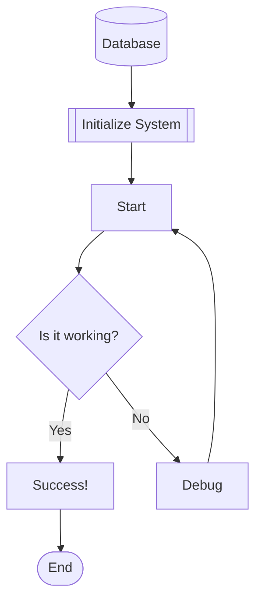

# Test Mermaid Diagram

This is a test flowchart for CollabCanvas Mermaid import.

## Features Tested:
- Rectangle nodes [text]
- Decision diamonds {text}
- Stadium nodes ([text])
- Rounded rectangles [[text]]
- Cylinder (database) [(text)]
- Connections with labels
- Multiple paths

